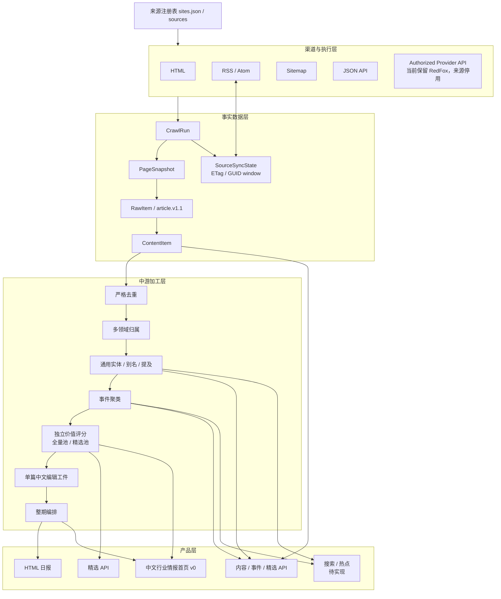
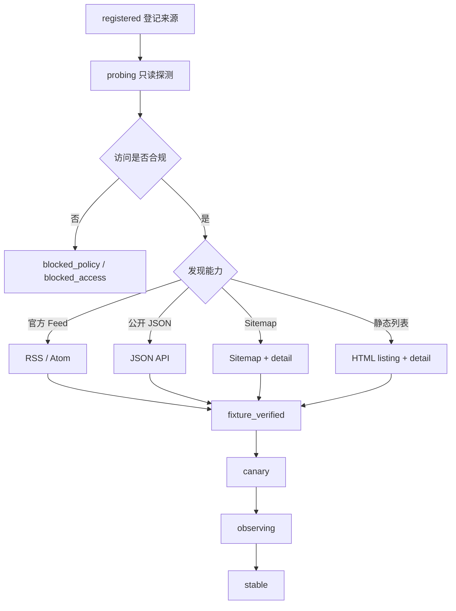

# Navigate 项目架构

本文是当前架构的唯一正式说明。旧 SVG、参考项目和实验流程已转入存档，不代表现行能力。

## 分层架构



公众号离线导入、公众号浏览器采集和 WeWe RSS 不属于现行架构。历史公众号文章只作为数据库中已经存在的事实数据继续向下游流动。

RedFox 公众号名单独立存放在 `backend/config/wechat_accounts.json`。目录层只把具有微信号、原始 ID 或 bizInfo 的 `ready` 项编译为 `CatalogSource`；`pending` 项不会进入来源调度。Provider 端点、D-1 日期规则、显式置顶/广告排除和密钥变量由编译器统一注入，避免为每个账号复制配置。改名账号用 `aliases` 保留历史名称，并按 Provider 原始 ID 维持单一采集身份。

## 渠道分类

必须区分四个维度：

| 维度 | 作用 | 示例 |
|---|---|---|
| 来源载体 | 谁发布内容 | website、wechat、data_provider |
| 传输通道 | 数据如何到达 | web、rss、api、third_party_feed |
| 执行引擎 | 如何发现和解析 | static_http、feed_direct、sitemap_http、json_api、provider_api |
| 供应商 | 直接来源或第三方 | direct、redfox |

当前数据库仍主要使用 `channel_type` 和 `parser_config` 表达这些信息。`source-pipeline.v1` 已把发现、正文获取、解析和增量策略拆成可组合字段；只有人工验收为 `verified` 后才能投影回现有运行配置。

运行时已经按 [`execution-engine.v1`](../contracts/execution-engine.v1.md) 建立五引擎注册表。渠道适配器只校验渠道和引擎是否兼容并完成调度；共享编排器负责 HTTP、robots、重试、快照与统一入库；HTML、Feed、Sitemap、JSON 和 RedFox 的发现、增量或 Provider 规则由各自引擎实现。

RedFox 的正式日期条件只能是来源时区内的前一自然日。运行时读取倒序列表并自动翻页，直到出现早于目标日的条目或到达列表末尾；首篇、第二篇和其他顺位都不参与选择。命中日期后，只有上游明确的置顶/广告布尔字段、类型或标签可以排除条目，`orderNum` 和标题关键词不能作为证据。RedFox 当前来源仍默认停用，启用前需重新完成授权、预算和多日稳定性验收。

日期型来源在 CrawlRun 创建时冻结 `coverage_date` 与 `publication_timezone`。调度任务默认覆盖来源时区前一自然日；手动补采可以指定更早日期；重试继承原任务日期和时区。执行器不得因跨日或来源配置变化重新计算目标日。

## 新增来源的标准接入流程



只读 `SourceProbe` 已实现以下检测并输出 `source-probe-result.v1`，但不直接启用来源：

- canonical domain、重定向和 Content-Type。
- robots、授权与访问限制。
- RSS/Atom、Sitemap、JSON、HTML 列表候选。
- JSON-LD、OpenGraph、标题、正文、作者、发布时间覆盖率。
- Feed 全文/摘要、页面 JS 壳、挑战页和订阅墙分类。
- 多样本解析稳定性及失败原因。

联网入口当前只提供本机 CLI。匿名 FastAPI 尚无管理认证，因此不开放“输入 URL 即联网”的 Probe API，避免扩大 SSRF 和资源消耗风险。

## 执行优先级

按低成本、稳定和合规原则有序选择，不并发轰炸所有入口：

```text
官方 RSS/Atom
→ 公开 JSON API
→ Sitemap + HTML detail
→ 静态 HTML listing + detail
→ 经授权的第三方 API/Feed
→ metadata_only / blocked
```

若 Feed 只有摘要，可以组合为“Feed 发现 + HTML 正文”。未来浏览器引擎只处理 robots 和条款允许的普通 JavaScript 渲染，不处理验证码、登录或付费绕过。

## 数据契约边界

- 发现结果将来输出 `discovered-item.v1`。
- 正文解析统一输出现有 `article.v1.1`。
- `source-pipeline.v1.engine` 固化为 `parser_config.execution_engine`，与 `discovery_method` 冲突时拒绝运行。
- HTTP 快照、运行 ID、解析引擎和版本属于溯源信封。
- ETag、游标、水位和最近外部 ID 属于同步状态，不进入不可变文章契约。
- RSS/Atom 已按 [`source-sync-state.v1`](../contracts/source-sync-state.v1.md) 实现条件请求、304、GUID/Atom ID 条目指纹窗口和提交后 checkpoint；API cursor、Sitemap 水位仍待实现。
- RedFox 无时区 `publishTime` 按来源配置 `publication_timezone` 解释，并转换为 UTC 写入 `article.v1.1.published_at`；日期准入在转换前按来源自然日判断。
- 日期型任务遵循 [`crawl-run-coverage.v1`](../contracts/crawl-run-coverage.v1.md)；历史时间纠错只追加 Raw 版本，不覆盖原始事实。
- 实体加工遵循 [`entity-mentions.v1`](../contracts/entity-mentions.v1.md)：实体主库跨领域共享，领域配置只提供种子和提取策略；当前查询只读取与 ContentItem 当前内容哈希匹配的成功结果。
- LLM 候选遵循 [`entity-candidates.v1`](../contracts/entity-candidates.v1.md)：有界 evidence、精确原文子串、本地偏移重建和完整缓存指纹均通过后才投影为提及；模型无权创建或合并实体。
- 未解析提及先同步到候选审查表；只有带操作者、原因和证据的 `create`、`link` 或 `reject` 决定才能更新当前解析投影。确认决定可以安全重放，冲突决定必须拒绝。
- 资讯价值评分遵循 [`content-value-score.v1`](../contracts/content-value-score.v1.md)：领域、配置和评分时点独立冻结；分项、扣分、门槛与理由全部保存。正文长度只属于完整性信号，pending 实体不参与，单篇事件不得获得跨来源佐证分。
- 事件自动阈值保持保守；跨语言或改写幅度大的同一事件可以通过带理由、操作者和成对内容 ID 的 `must_link` 人工约束确认。约束形成的成员保存 `decision_source=manual` 和完整约束证据，不伪装成算法命中。
- beauty 领域的活动准入器为 `domain_hybrid / beauty-domain-hybrid.v1`：确定性规则先处理无证据内容，LLM 再逐篇复核综合来源和垂直来源候选；来源标签只提供候选证据，不能整站放行。活动分类器由领域配置显式指定，评分与日报只读取该版本的当前内容哈希结果。
- 前端使用 Vue 3 Composition API + TypeScript 实现，并通过 [`navigate-home.v1`](../contracts/navigate-home.v1.md) 只读快照连接当前精选结果和已缓存中文编辑工件；非中文原文缺少合格中文工件时从展示快照省略，不回退为英文。`ranking_score` 仅用于内部排序，界面不展示评分和算法说明。事件关系仍由快照携带供未来“相关报道/热点”使用，但当前首页不渲染事件入口或独立事件卡片。
- 配置化别名唯一命中时可以确定性链接；同名命中多个实体时保持歧义候选，不根据字符串相似度强制合并。
- 对外生成 RSS 只能是标准内容的只读产品视图，不能被同一来源回采形成身份循环。

## 目录边界

- `backend/app`：只放正式运行时。
- `backend/scripts`：只放可继续执行和维护的入口。
- `backend/tests`：只验证正式能力。
- `docs`：只描述当前事实和目标架构。
- `output`：只保留当前交付物及最终验收基线。
- `archive`：历史实现、实验、过程报告和旧结果；正式代码不得引用。
